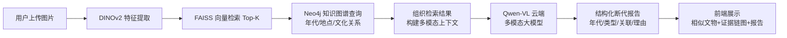

# 🏛️ 考古文物断代与鉴定系统（Artifact Scanning System）

基于 **视觉检索 + 知识图谱 + 多模态大模型（RAG）** 的考古文物断代与鉴定系统。

上传文物图片 → 系统推断年代、关联同类文物，并给出带证据链的解释报告。

## ✨ 处理流程



## 🧰 技术栈

| 模块 | 技术 |
|---|---|
| 语言 | Python 3.10 |
| 深度学习 | PyTorch 2.4.1 · torchvision 0.19.1 · Transformers 4.43.3 |
| 视觉特征 | DINOv2 (facebook/dinov2-base) · CLIP (openai/clip-vit-base-patch32) |
| 多模态 LLM | Qwen-VL（阿里百炼云端 API，OpenAI 兼容） |
| 向量检索 | FAISS 1.7.4（HNSW） |
| 知识图谱 | Neo4j Community 5.x（neo4j 驱动） |
| 微调 | PEFT（可选：LoRA 在 Google Colab） |
| 前端 Demo | Gradio >=4.26.0 |
| 数据 | MET Open Access API · Wikidata SPARQL |
| 部署 | Docker（python:3.10-slim + CPU PyTorch）· Neo4j 容器 |

## 🗺️ 分阶段实施

| 阶段 | 内容 | 预计周期 | 状态 |
|---|---|---|---|
| 阶段 1 | 数据准备与环境搭建 | 2-3 周 | ✅ 完成 |
| 阶段 2 | 建立检索基线（DINOv2 + FAISS + Neo4j + Gradio） | 3 周 | ✅ 完成 |
| 阶段 3 | 加入 LLM 推理与证据链（云端 Qwen-VL） | 5 周 | ✅ 完成(4/5) |
| 阶段 4 | Demo 完善与部署（Docker） | 3 周 | 🔄 进行中 |

> 📌 详细进度见 [PROGRESS.md](PROGRESS.md)，技术架构见 [docs/architecture.md](docs/architecture.md)。

## 🚀 快速开始（Docker）

```powershell
# 1. 配置密钥（复制模板后填入）
#    QWEN_API_KEY   阿里百炼：https://bailian.console.aliyun.com/
#    NEO4J_PASSWORD 自定义数据库密码
copy .env.example .env

# 2. 一键启动（构建 + 启动 Neo4j + 应用）
powershell -ExecutionPolicy Bypass -File scripts/start.ps1

# 3. 打开界面
#    应用：http://localhost:7860
#    Neo4j：http://localhost:7474
```

> 📌 详细复现步骤见 [docs/reproducibility.md](docs/reproducibility.md)，架构见 [docs/architecture.md](docs/architecture.md)。

## 📁 目录结构

```
artifact-scanning-system/
├── README.md            # 项目说明（本文件）
├── PROGRESS.md          # 进度跟踪（四个阶段 Checklist）
├── requirements.txt     # 依赖清单（阶段 1 锁定）
├── config/              # 配置文件
├── docs/                # 架构与文档
├── data/                # 数据（git 忽略，DVC 管理）
│   ├── raw/             # 原始图片与元数据
│   ├── features/        # 特征向量 (.npy / Parquet)
│   └── kg/              # 知识图谱导入数据
├── src/                 # 核心代码
│   ├── features/        # DINOv2 特征提取
│   ├── retrieval/       # FAISS 检索 + 组合服务
│   ├── kg/              # Neo4j 图谱查询
│   ├── llm/             # Qwen-VL 断代报告
│   └── viz/             # 证据链网络图
├── app/                 # Gradio Demo（检索+报告+证据链图）
├── scripts/             # 数据/评估/部署脚本
├── notebooks/           # 实验 Notebook
├── models/              # 模型权重（git 忽略）
└── tests/               # 测试
```

## ⚖️ 许可与数据合规

- 开放数据来源：MET Open Access (CC0/Public Domain)、Europeana、Wikidata
- 模型权重：Qwen2.5-VL (Apache 2.0)、DINOv2/CLIP (Apache 2.0 / MIT)
- 本项目代码：Apache 2.0（见 LICENSE）
