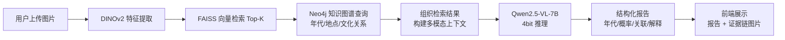

# 🏛️ 考古文物断代与鉴定系统（Artifact Scanning System）

基于 **视觉检索 + 知识图谱 + 多模态大模型（RAG）** 的考古文物断代与鉴定系统。

上传文物图片 → 系统推断年代、关联同类文物，并给出带证据链的解释报告。

## ✨ 处理流程



## 🧰 技术栈

| 模块 | 技术 |
|---|---|
| 语言 | Python 3.10 |
| 深度学习 | PyTorch 2.4.1 · torchvision 0.19.1 · Transformers 4.43.3 |
| 视觉特征 | DINOv2 (facebook/dinov2-base) · CLIP (openai/clip-vit-base-patch32) |
| 多模态 LLM | Qwen2.5-VL-7B-Instruct（4bit 量化，LoRA 微调） |
| 向量检索 | FAISS 1.7.4（HNSW / IVF） |
| 知识图谱 | Neo4j Community 5.x（neo4j >=5.19.0 驱动） |
| 微调 | PEFT 0.11.1 · Bitsandbytes 0.43.1 |
| 前端 Demo | Gradio >=4.26.0 |
| 数据 | MET Open Access API · Europeana · Wikidata SPARQL |
| 部署 | Docker + nvidia/cuda:12.1-runtime-ubuntu22.04 · Conda |

## 🗺️ 分阶段实施

| 阶段 | 内容 | 预计周期 | 状态 |
|---|---|---|---|
| 阶段 1 | 数据准备与环境搭建 | 2-3 周 | ⬜ 未开始 |
| 阶段 2 | 建立检索基线（DINOv2 + FAISS + Neo4j + Gradio） | 3 周 | ⬜ 未开始 |
| 阶段 3 | 加入 LLM 推理与证据链（Qwen2.5-VL + LoRA） | 5 周 | ⬜ 未开始 |
| 阶段 4 | Demo 完善与部署（Docker） | 3 周 | ⬜ 未开始 |

> 📌 详细进度见 [PROGRESS.md](PROGRESS.md)，技术架构见 [docs/architecture.md](docs/architecture.md)。

## 🚀 快速开始（占位，待阶段 1 完成后填写）

```bash
# 1. 创建 Conda 环境
conda create -n artifact python=3.10 -y
conda activate artifact

# 2. 安装依赖（阶段 1 锁定版本后生效）
pip install -r requirements.txt

# 3. 运行 Demo
python app/app.py
```

## 📁 目录结构

```
artifact-scanning-system/
├── README.md            # 项目说明（本文件）
├── PROGRESS.md          # 进度跟踪（四个阶段 Checklist）
├── requirements.txt     # 依赖清单（阶段 1 锁定）
├── config/              # 配置文件
├── docs/                # 架构与文档
├── data/                # 数据（git 忽略，DVC 管理）
│   ├── raw/             # 原始图片与元数据
│   ├── features/        # 特征向量 (.npy / Parquet)
│   └── kg/              # 知识图谱导入数据
├── src/                 # 核心代码
│   ├── data/            # 数据下载与处理
│   ├── features/        # DINOv2 / CLIP 特征提取
│   ├── retrieval/       # FAISS 检索
│   ├── kg/              # Neo4j 查询
│   └── llm/             # Qwen2.5-VL 推理与微调
├── app/                 # Gradio Demo
├── scripts/             # 一键脚本
├── notebooks/           # 实验 Notebook
├── models/              # 模型权重（git 忽略）
└── tests/               # 测试
```

## ⚖️ 许可与数据合规

- 开放数据来源：MET Open Access (CC0/Public Domain)、Europeana、Wikidata
- 模型权重：Qwen2.5-VL (Apache 2.0)、DINOv2/CLIP (Apache 2.0 / MIT)
- 本项目代码：Apache 2.0（见 LICENSE）
