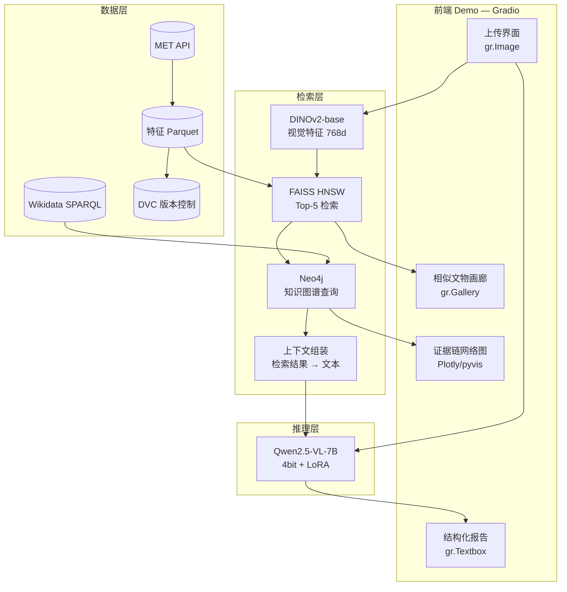
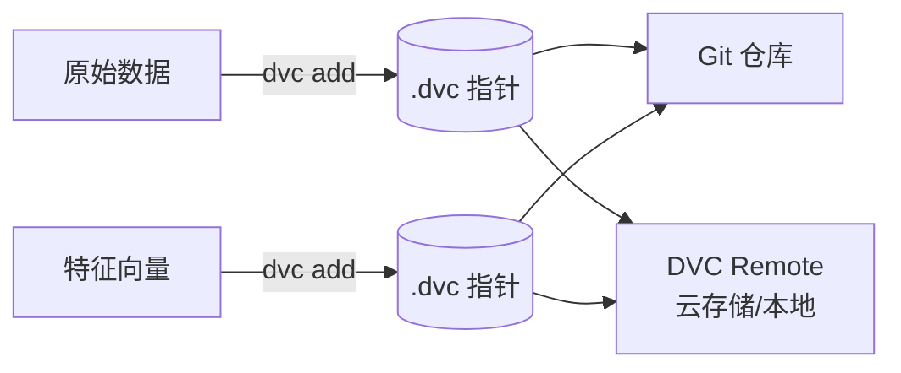

# 🏗️ 技术架构（Architecture）

## 系统总览



## 核心数据流

```
上传图片(JPG, ≤1024px)
    │ 预处理 + normalize
    ▼
DINOv2 前向 → [768] float32
    │ FAISS.search(5)
    ▼
Top-5: {image_path, score} × 5
    │ 每个文物查 Neo4j
    ▼
{title, period, site, culture, similarity}
    │ 组装成文本上下文
    ▼
Qwen2.5-VL 消息: [{image: 查询图}, {text: 上下文+指令}]
    │ 生成
    ▼
结构化报告: {年代推断, 置信度, 关联文物, 解释理由}
```

## 关键设计决策

| 决策点 | 选择 | 理由 |
|---|---|---|
| 视觉模型 | DINOv2-base | 自监督特征，适合纯视觉相似度；768 维足够 |
| 检索索引 | HNSW | 5 万级数据在线检索毫秒级，精度高 |
| 图谱引擎 | Neo4j | 多跳关系查询（文物→遗址→文化→文物） |
| LLM | Qwen2.5-VL-7B | 中文考古能力强，32K 上下文，Apache 2.0 |
| LLM 部署 | 4bit NF4 量化 | 24GB 显存可推理；必要时降到 3B |
| 微调 | LoRA + gradient_checkpointing | 24GB 显存可训练 |
| 前端 | Gradio | 快速迭代，内置 Gallery/Textbox |

## 数据版本控制（DVC）



- `data/` 下的大文件不入 Git，由 DVC 跟踪
- 每个数据变更会生成 `.dvc` 指针文件入库

## 目录职责

| 目录 | 职责 | 主要产物 |
|---|---|---|
| `src/data/` | 数据下载、清洗、预处理 | CSV/JSONL、图片 |
| `src/features/` | DINOv2/CLIP 特征提取 | Parquet、.npy |
| `src/retrieval/` | FAISS 索引构建与搜索 | .index |
| `src/kg/` | Neo4j 导入与查询封装 | Cypher 查询 |
| `src/llm/` | Qwen 加载/推理/微调 | 报告生成 |
| `app/` | Gradio 界面 | 前端 |
